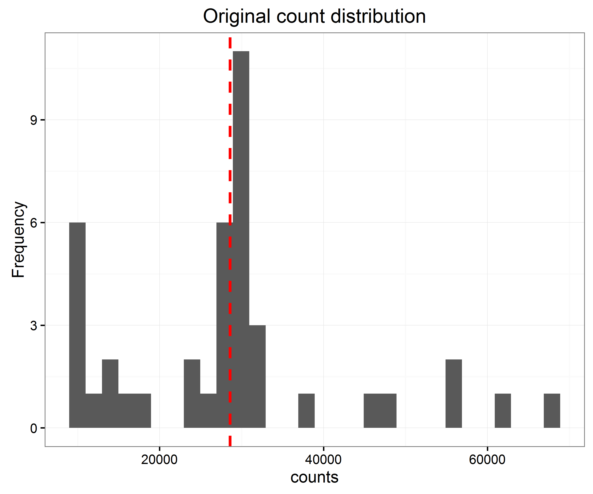
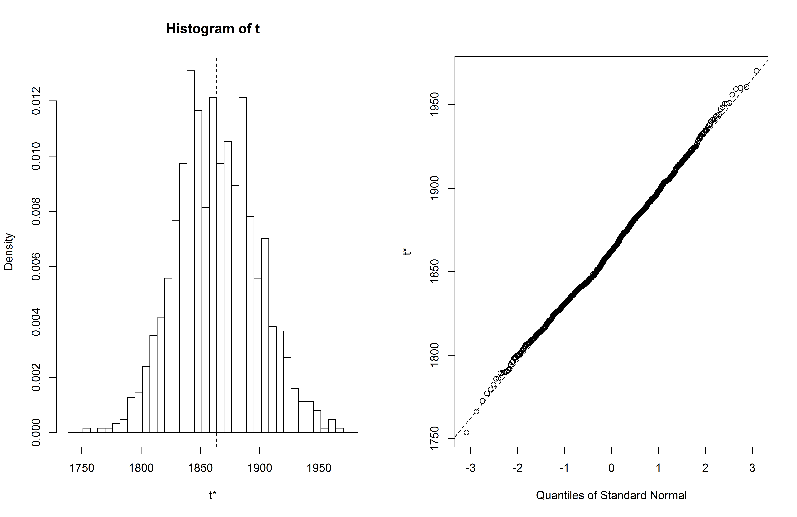
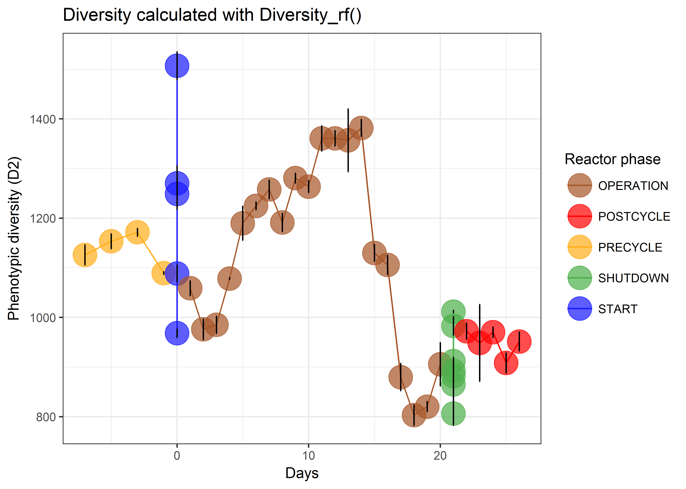

# Install the package

Make sure to have the `devtools` package loaded.

```{r install, eval=FALSE}
library(devtools)
install_github("rprops/Phenoflow_package")
```

# Load the packages and source code

```{r load packages, message=FALSE,warning=FALSE}
library("Phenoflow") # for fingerprinting
library("flowViz") # for plotting
library("ggplot2") # for plotting
library("flowAI") # for denoising
```

Set a fixed seed to ensure reproducible analysis

```{r setseed}
set.seed(777)
```

## Load data
Load the test data or insert the path to your own data folder, for example
test_data for the tutorial data.

```{r read test data}
data(flowData)
#path = "test_data"
#flowData <- read.flowSet(path = path, transformation = FALSE, pattern=".fcs")
```
Lets first take a quick look at the dimensions of our flowData using the 
`attributes` function. Here we can see that we have 12 parameters (+ Width/Time)
which we can use in our analyses.

```{r look at flowdata,output='asis'}
attributes(flowData)
```

## Denoise data

Next, we select the phenotypic features of interest and transform their 
intensity values according to the hyperbolic arcsin. In this case we chose two
fluorescent parameters and two scatter parameters in their height format (-H). 
Depending on the FCM, the resolution may increase by using the area values (-A)
since many detectors have a higher signal resolution for area values. 
For transparency we store the transformed data in a new object, called 
`flowData_transformed`. We also define the parameters of interest (e.g. 
`c("FL1-H", "FL3-H","SSC-H","FSC-H")`)

```{r select and transform}
# Select phenotypic features of interest and transform parameters
flowData_transformed <- transform(flowData,`FL1-H`=asinh(`FL1-H`), 
                                   `SSC-H`=asinh(`SSC-H`), 
                                   `FL3-H`=asinh(`FL3-H`), 
                                   `FSC-H`=asinh(`FSC-H`))
param=c("FL1-H", "FL3-H","SSC-H","FSC-H")
remove(flowData)
```

Now that the data has been formatted, we need to discard all the signals 
detected by the FCM which correspond to instrument noise and (in)organic 
background. This is done by selecting the cells in a scatterplot on the 
primary fluorescence or scatter signals. For SYBR Green I, this is done based 
on the `FL1-H` and `FL3-H` parameters. For this example, an initial polygon gate
(`polyGate1`) is created and adjusted based on the sample type in question. For
each specific experiment, it is advised to use identical gating for each sample.
The gating strategy is evaluated on the `flowViz::xyplot` and adjusted if 
necessary. A more detailed guideline for gating or denoising aquatic microbial 
samples can be found [here](http://jornades.uab.cat/workshopmrama/sites/jornades.uab.cat.workshopmrama/files/Assessing_water_quality_with_the_BD_Accuri_C6_flow_cytometer.pdf) (p.6).

```{r setting and checking the gate, fig.show='hide'}
### Create a PolygonGate for denoising the dataset
### Define coordinates for gate in sqrcut1 in format: c(x,x,x,x,y,y,y,y)
sqrcut1 <- matrix(c(8.75,8.75,14,14,3,7.5,14,3),ncol=2, nrow=4)
colnames(sqrcut1) <- c("FL1-H","FL3-H")
polyGate1 <- polygonGate(.gate=sqrcut1, filterId = "Total Cells")

###  Gating quality check
xyplot(`FL3-H` ~ `FL1-H`, data=flowData_transformed[1], filter=polyGate1,
       scales=list(y=list(limits=c(0,14)),
                   x=list(limits=c(6,16))),
       axis = axis.default, nbin=125, 
       par.strip.text=list(col="white", font=2, cex=2), smooth=FALSE)
```

Here is an example of a good and bad filtering approach:
```{r gatingraphs, echo=FALSE, out.width="700px",out.height="350px"}
knitr::include_graphics("FigGating.png")
```

When the optimal gate has been chosen, the data can be denoised using the 
`Subset` function. Next we will gather some metadata from the sample names, 
which requires you have some pre-defined structured naming for your samples. 

```{r extractnames}
### Isolate only the cellular information based on the polyGate1
flowData_transformed <- Subset(flowData_transformed, polyGate1)

### Extract metadata from sample names
metadata <- data.frame(do.call(rbind, 
                               lapply(strsplit(flowCore::sampleNames(flowData),
                                               "_"), rbind)))
colnames(metadata) <- c("Cycle_nr", "Location", "day", "timepoint", "Staining",
                        "Reactor_phase", "replicate")
```

Next, the phenotypic intensity values of each cell are normalized to the [0,1] 
range. This is required for using a bandwidth of 0.01 in the fingerprint 
calculation. Each parameter is normalized based on the maximum FL1-H intensity 
value over the data set.

```{r rescaling}
summary <- fsApply(x = flowData_transformed, FUN = function(x) apply(x, 2, max),
                   use.exprs = TRUE)
maxval <- max(summary[,9])
mytrans <- function(x) x/maxval
flowData_transformed <- transform(flowData_transformed,`FL1-H`=mytrans(`FL1-H`),
                                  `FL3-H`=mytrans(`FL3-H`), 
                                  `SSC-H`=mytrans(`SSC-H`),
                                  `FSC-H`=mytrans(`FSC-H`))
```

## Fingerprinting

The denoised data can now be used for calculating the phenotypic fingerprint 
using the `flowBasis` function. Changing `nbin`increases the grid resolution of
the density estimation but also steeply increases the computation time. The most
determining factor for getting an accurate kernel density estimation is the 
number of cells counted in `polyGate1`. In general, 1,000 cells will give a good
estimation of the mean alpha-diversity ($\text{D}_2$) but in order to reduce the
variance on this estimate I would recommend a cell count of 10,000 cells or more.
You can find more details [here](https://github.com/rprops/Phenoflow_package/wiki/Effect-of-sample-size"). If desired, you can randomly resample your samples to the lowest sample 
size or any user specified sample size using the `FCS_resample()` function 
(standard without replacement, but can adjust by changing `replace`. Samples 
with a sample size that is equal to 0 or that is lower than the specified size
will be discarded.

```{r create flowbasis}  
### Randomly resample to the lowest sample size
#flowData_transformed <- FCS_resample(flowData_transformed, replace=TRUE)
### Calculate fingerprint with bw = 0.01
fbasis <- flowBasis(flowData_transformed, param, nbin=128, 
                   bw=0.01,normalize=function(x) x)
```
The histogram below shows how the original distribution of sample sizes in our 
demo dataset was.
```{r samplesizedistri, echo=FALSE, out.width="700px",out.height="583px"}

```
Subsampling to the lowest sampling size can be performed:
```{r resample}
fd_transformed <- FCS_resample(flowData_transformed, replace=TRUE)
```

## Alpha diversity calculation

In this case we will continue with the samples without randomly subsampling. 
From the phenotypic fingerprint, alpha diversity metrics can be calculated.`n` 
is the number of technical replicates. Bootstrapping has been implemented for 
the Diversity function, so errors are calculated for each sample separately.  
`R` is the number of bootstraps.  `d` is a rounding factor which is used to
remove spurious density values from the dataset. Different rounding factors 
usually only scale the diversity estimates by a fixed factor and do not affect 
temporal trends or comparative analysis.

```{r calculate alphadiv} 
### Calculate Diversity from normalized fingerprint 
Diversity.fbasis <- Diversity(fbasis,d=3,plot=FALSE, R=999)
``` 

Add the argument `plot=TRUE` in case a quick plot of the ($\text{D}_2$) 
diversity values with their errors is desired. A bit more tidied up figure can
be easily achieved as such:

```{r d2plot, fig.width=7,fig.height=5.8}  
p1 <- ggplot(data = Diversity.fbasis, 
             aes(x = as.numeric(as.character(metadata$day)),
                 y = D2, color = metadata$Reactor_phase))+
      geom_point(size = 8, alpha = 0.7)+
      geom_line()+
      scale_color_manual(values = c("#a65628", "red", "#ffae19", "#4daf4a",
                                    "#1919ff", "darkorchid3", "magenta"))+
      theme_bw()+
      labs(color = "Reactor phase", 
           y = "Phenotypic diversity (D2)", 
           x = "Days")+
      geom_errorbar(aes(ymin=D2-sd.D2, ymax=D2+sd.D2), width=0.05,
                    color="black")
print(p1)
```

Typically for FCM data, the bootstrap replication results in an approximate 
normal distribution:
```{r bootstrapdistri, echo=FALSE, out.width="700px",out.height="455px"}

```

### **Important:** `Diversity_rf` function

This function allows more accurate diversity and error estimation by 
bootstrapping from the initial FCS files, as well as denoising through 
[flowAI: automatic and interactive anomaly discerning tools for flow cytometry data](https://academic.oup.com/bioinformatics/article-lookup/doi/10.1093/bioinformatics/btw191).
It can also easily be parallelized by setting `parallel = TRUE` and defining 
the number of cores with `ncores`. On Windows, you may have to give 
administrator permission the first time you try to parallelize (and have library
`foreach` loaded). The input is a **non-subsetted** flowSet object (i.e. no 
parameters were removed - flowAI crashes otherwise) in case automated denoising 
is desired (`cleanFCS = TRUE`). Otherwise a normal subsetted flowSet object is
enough. `R` is the number of bootstraps that should be taken from the initial
FCS file, `R.b` is the number of bootstraps that should be taken from the 
fingerprint object.

```{r diversityrf}
# Diversity assessment with cleaning
Diversity.clean <- Diversity_rf(flowData_transformed, param = param, R = 3, 
                                R.b = 3,cleanFCS = TRUE)
```

Similarly as before, we can plot these diversity calculations as well. Note that
we only took 3 bootstraps here. It is recommended to increase `R` and `R.b` to
100.

```{r plotbootstrapped, echo=TRUE, fig.show='hide'}
p2 <- ggplot(data = Diversity.clean, 
             aes(x = as.numeric(as.character(metadata$day)),
                 y = D2, color = metadata$Reactor_phase))+
  geom_point(size = 8, alpha = 0.7)+
  geom_line()+
  scale_color_manual(values = c("#a65628", "red", 
                                "#ffae19", "#4daf4a", "#1919ff", 
                                "darkorchid3", "magenta"))+
  theme_bw()+
  labs(color = "Reactor phase", y = "Phenotypic diversity (D2)", x = "Days")+
  geom_errorbar(aes(ymin=D2-sd.D2, ymax=D2+sd.D2), width=0.05, color="black")
print(p2)
```

```{r divrffig, echo=FALSE, out.width="700px",out.height="500px"}

```

Alpha diversity analysis has completed: time to export all the data to your 
working directory. If you are not sure where this is, type `getwd()`.

```{r export diversity}  
### Export ecological data to .csv file in the chosen directory
names(Diversity.clean) <- paste0(names(Diversity.clean),".clean")
write.csv2(file="results.metrics.csv",
           cbind(Diversity.fbasis,Diversity.clean))
```

## Beta diversity analysis
Optionally, you can also perform a beta diversity analysis using Non-metric
Multidimensional Scaling (NMDS) or PCoA from the `vegan` package. The
`beta_div_fcm` function does the calculation (accepts all dissimilarity metrics 
of the `vegdist` function under the `dist` argument) and the `plot_beta_fcm` 
plots the ordination. Additional factorial arguments to be given to the plot 
function are: `color` and `shape` which can be used for visualization (`color` 
and `shape` have to be factor vectors with length equal to number of samples). 
The title of the legends for these factors can be specified in the `labels` 
argument. In case no legend has to be displayed, `legend.pres` can be put to
`FALSE`.
**Attention: this dimension reduction utilizes the density values as opposed to the count values which are used for beta-diversity analysis in community 16S rRNA gene amplicon sequencing data sets**

```{r betadiv, fig.width=7,fig.height=5}  
# Beta-diversity assessment of fingerprint
set.seed(777)
beta.div <- beta_div_fcm(fbasis, ord.type="PCoA")

# Plot ordination
plot_beta_fcm(beta.div, color = metadata$Reactor_phase, labels="Reactor phase") + 
  theme_bw() +
  geom_point(size = 8, alpha = 0.5)
```

## Extract cell counts
It is often also useful to know the exact cell densities of your sample. This is
performed by the following code. Additionally it quantifies the amount of High 
Nucleic Acid (HNA) and Low Nucleic Acid (LNA) bacteria as defined by [Prest et al. (2013)](http://www.sciencedirect.com/science/article/pii/S0043135413008361). Be
aware that the `flowCore::filter` function has conflicts with the filter 
function from the `dplyr::filter` package (which is why we call them 
explicitely)

**Warning: the HNA/LNA partition is only valid for data gathered on a BD Accuri 
C6 flow cytometer.For other flow cytometers the HNA/LNA cutoff (FL1-H = 20 000) 
should be adjusted according to the appropriate reference samples.**

```{r cellcountsHNALNA, fig.width=7,fig.height=5,results='hide'}
### Creating a rectangle gate for counting HNA and LNA cells
rGate_HNA <- rectangleGate("FL1-H"=c(asinh(20000), 20)/maxval,
                           "FL3-H"=c(0,20)/maxval, 
                           filterId = "HNA bacteria")
### Normalize total cell gate
sqrcut1 <- matrix(c(8.75,8.75,14,14,3,7.5,14,3)/maxval,ncol=2, nrow=4)
colnames(sqrcut1) <- c("FL1-H","FL3-H")
polyGate1 <- polygonGate(.gate=sqrcut1, filterId = "Total Cells")

### Check if rectangle gate is correct, if not, adjust rGate_HNA
xyplot(`FL3-H` ~ `FL1-H`, data=flowData_transformed[1], filter=rGate_HNA,
       scales=list(y=list(limits=c(0,1)),
                   x=list(limits=c(0.4,1))),
       axis = axis.default, nbin=125, par.strip.text=list(col="white", font=2, 
                                                          cex=2), smooth=FALSE)
### Extract the cell counts
a <- flowCore::filter(flowData_transformed, rGate_HNA) 
HNACount <- summary(a);HNACount <- toTable(HNACount)
s <- flowCore::filter(flowData_transformed, polyGate1)
TotalCount <- summary(s);TotalCount <- toTable(TotalCount)

### Extract the volume
vol <- c()
for(i in 1:length(flowData_transformed)){
  vol[i] <- as.numeric(flowData_transformed[[i]]@description$`$VOL`)/1000
}

### Store the data
results_counts <- data.frame(Samples=flowCore::sampleNames(flowData_transformed), 
                             Total.cells = TotalCount$true/vol, 
                             HNA.cells = HNACount$true/vol)

```
Finally, you can export the count data if you so desire.
```{r export count data}
### Exporting cell counts to .csv file to working directory
write.csv2(file="results.counts.csv", results_counts)
```

```{r plot cell density, fig.width=7,fig.height=5}
### Plot cell density
ggplot(data = results_counts, aes(x = as.numeric(as.character(metadata$day)), y = Total.cells, color = metadata$Reactor_phase))+
  geom_point(size = 8, alpha = 0.9)+
  scale_color_manual(values = c("#a65628", "red", 
                                "#ffae19", "#4daf4a", "#1919ff", "darkorchid3", "magenta"))+
  theme_bw()+
  labs(color = "Reactor phase", y = "Total cell density (cells/µL)", x = "Days")  
```